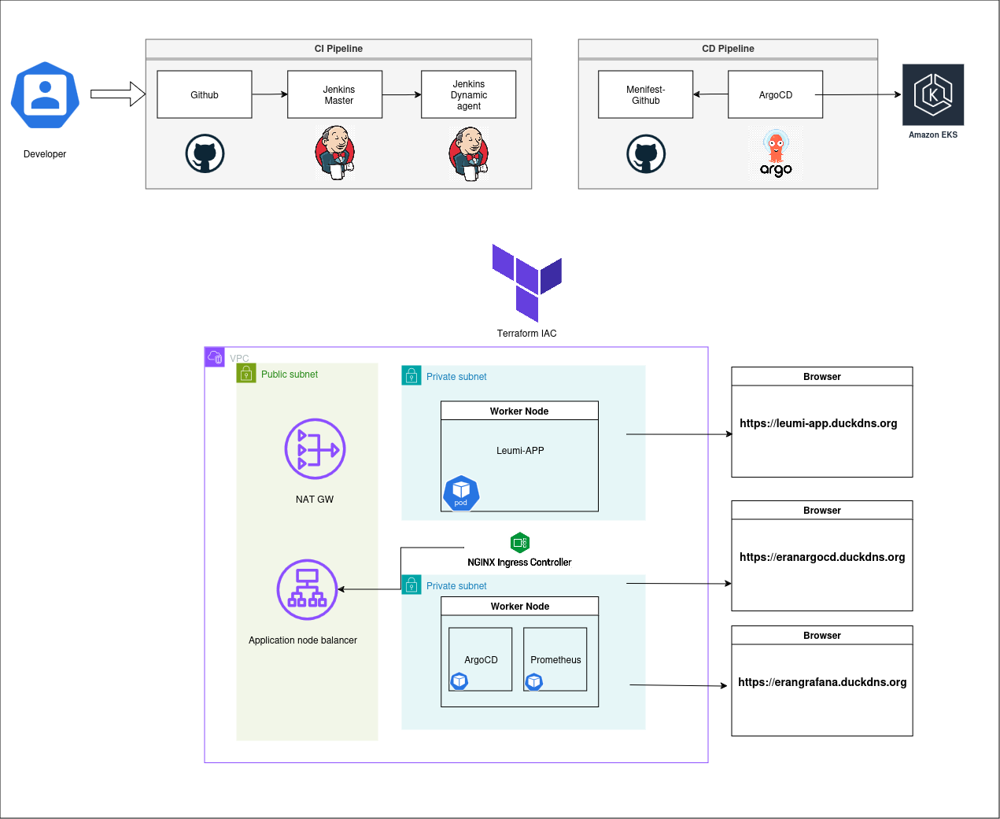

## CICD pipeline Project

Designed to dynamically create and manage Kubernetes resources using Terraform and GitOps principles. 
This project ensures efficient CI/CD pipelines, monitoring, accessing web app with HTTPS protocol and ingress management for better security.
---

## Features
This project leverages **Terraform** to provision and manage the following infrastructure:
- **VPC**: Dynamically creates VPC with private and public subnets.
- **Amazon EKS**: Deploys an EKS cluster with:
  - Two t3.medium spot instances.
- **Ingress Controller**: Manages external traffic to services within the cluster.
- **ArgoCD**: Implements GitOps for automated deployments, accessible via hostname.
- **Prometheus**: Monitors traffic flowing through the ingress controller to the cluster.

---

## Repositories

This project is split into two repositories:

1. **[GitOps_project](https://github.com/eranzaksh/GitOps_Project.git)** (This repository)  
   Contains the web-app. Also adding terraform modules, questions 2-4 and tf file for quesion number 5 for ease of read.
   
2. **[CD_Project](https://github.com/eranzaksh/GitOps_Project_CD.git)**  
   Manages the Continuous Deployment (CD) pipeline with ArgoCD using Helm package.

---

## CI/CD Pipelines

### **CI Pipeline (Triggered via Webhook)**  
Jenkins *dynamically* creates an AWS agent to execute the CI pipeline when a commit is pushed to this repository.

1. **Pull**: Clone the latest code from the repository.
2. **Linting**: Run linting in parallel with dependency scanning.
3. **Build**: Compile or package the application.
4. **Test**: Execute automated tests.
5. **Push**: Push artifacts or images to the repository.
6. **Trigger CD Pipeline**: Initiate the CD pipeline.
7. **Message**: Notify slack about the pipeline status.

### **CD Pipeline (GitOps with ArgoCD)**  
Once triggered from the CI pipeline, the CD pipeline performs the following steps:

1. **Pull**: Clone the latest code from the repository.
2. **Connect to ArgoCD and configure duckdns**: Authenticate with ArgoCD and configure hostnames.
3. **Change Manifest**: Update the application manifest.
4. **Create ArgoCD App**: Deploy or update the application using ArgoCD.

---

### **Ingress**
- All services, including **ArgoCD**, **Grafana**, and the **web app**, are accessible via ingress with a hostname from duckdns to increase security.

### **Prometheus & Grafana**
- Prometheus monitors cluster traffic, and Grafana provides visualization dashboards.

### **How to use repository**
```bash
terraform init
terraform apply --auto-approve
push code to repo
access app via: https://leumiapp.duckdns.org
access argocd server via: https://eranargocd.duckdns.org
access grafana server via: http://erangrafana.duckdns.org
```
### **Grafana configuration**
```bash
username: admin
password: prom-operator
import dashboard: 14314
```
